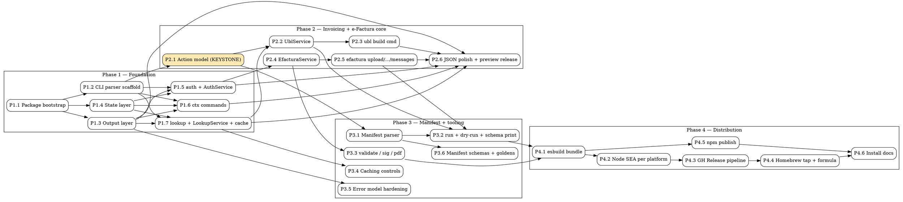

# ANAF CLI — Master Coordination Plan

> **Purpose:** This is the *coordination* plan for `anaf-cli`. It splits the design in `docs/anaf-cli-technical-design.md` into discrete workstreams, defines their dependencies, and identifies which can run in parallel via subagents. Each leaf workstream below should get its own detailed implementation plan (TDD, bite-sized tasks) before execution.
>
> **For agentic workers:** Do NOT execute tasks directly from this document. This is a graph, not a task list. To execute, pick a workstream node, generate its detailed plan via `superpowers:writing-plans`, then run it via `superpowers:subagent-driven-development`.

**Goal:** Ship a separate `anaf-cli` package that wraps the entire `anaf-ts-sdk` surface with imperative commands + manifest mode, distributable via `npx` and Homebrew. (Note: the SDK's git repo is `efactura-anaf-ts-sdk`; its npm package is `anaf-ts-sdk`.)

**Architecture:** Separate npm package depending on `anaf-ts-sdk`. Layered: `commands/` and `manifest/` parse input → shared `actions/` model → `services/` orchestrate SDK clients + local state. esbuild bundles a CommonJS entry; Node SEA produces standalone executables.

**Tech Stack:** TypeScript, Node ≥20, esbuild, YAML parser (TBD during P1.1), Node SEA, Homebrew formula, GitHub Actions.

---

## 0. Conventions

- **Workstream ID:** `P<phase>.<n>` (e.g. `P1.4`).
- **Status legend in dependency graph:** ⚪ not started · 🟡 in progress · 🟢 merged.
- **Subagent boundary:** every leaf workstream is a single subagent unit. Each must produce: code + tests + green build, no orphan TODOs.
- **Interface contracts:** workstreams that other nodes depend on MUST publish their public types/exports up-front before implementation work begins downstream. This is the only way the parallel arms below stay parallel.
- **Repo location:** new package lives in a sibling worktree initially; final layout decision (monorepo vs. separate repo) is locked in P1.1.

---

## 1. Phase Overview

| Phase | Theme | Outcome |
| --- | --- | --- |
| **Phase 1** | Foundation | A runnable `anaf-cli` binary that can manage contexts, authenticate, and do public ANAF lookups. |
| **Phase 2** | Invoicing + e-Factura core | `ubl build` + upload/status/download/messages working end-to-end via active context. |
| **Phase 3** | Manifest mode + tooling | `anaf-cli run -f job.yaml`, validation/signature/PDF tooling, hardened error model + caching controls. |
| **Phase 4** | Distribution | `npx anaf-cli` + `brew install …/anaf-cli` work on macOS arm64/x64 and Linux x64. |

Each phase ends in a *demonstrable, releasable* state (npm preview release at end of P2; first public release at end of P4).

---

## 2. Workstream Catalogue

### Phase 1 — Foundation

#### P1.1 — Package bootstrap & build tooling
- Create `anaf-cli` package skeleton (`package.json`, `tsconfig.json`, `bin` entry, lint/format).
- Pin Node ≥20. Add `efactura-anaf-ts-sdk` as a workspace/dep.
- Add `esbuild` build script targeting CJS bundle (used later by SEA); add `tsx`/`tsc` for dev.
- Decide CLI parser library and YAML library (open decisions §23 of design doc) and lock them here.
- **Deliverable:** `pnpm --filter anaf-cli build` produces `dist/bin/anaf-cli.js`; `node dist/bin/anaf-cli.js --version` prints the version.
- **Tests:** smoke test that the bin starts and exits 0 on `--version`.
- **Depends on:** none.

#### P1.2 — CLI parser scaffold + command tree skeleton
- Wire chosen CLI parser; register the full command tree from §6.1 as no-op handlers that return "not implemented".
- Centralized flag parsing helpers (`--context`, `--json`, `--out`, `--stdin`).
- Global error → exit code mapping stub (full hardening in P3.5).
- **Tests:** snapshot test of `--help` output for each top-level group.
- **Depends on:** P1.1.

#### P1.3 — Output layer
- Renderers: human text, JSON envelope, raw bytes (for XML/PDF later).
- Error envelope (§15.3) and exit-code constants (§15.2 — initial draft, hardened in P3.5).
- `stdout` vs `stderr` discipline helper.
- **Tests:** unit tests for each renderer; golden JSON envelope test.
- **Depends on:** P1.1.
- **Parallel with:** P1.2, P1.4.

#### P1.4 — State layer (config, contexts, tokens, cache files)
- `ContextService` (CRUD on `contexts/<name>.yaml`, `currentContext`).
- `TokenStore` (read/write `tokens/<name>.json`, expose refresh-token getter for SDK `TokenManager`, persist rotated refresh tokens).
- XDG path resolution helpers.
- File permission discipline (0600 on token files).
- **Tests:** unit tests against a tmpdir XDG root; round-trip create/read/update/delete; permission assertion.
- **Depends on:** P1.1.
- **Parallel with:** P1.2, P1.3.

#### P1.5 — `auth` commands + AuthService
- `AuthService` constructs `AnafAuthenticator`, generates URLs, exchanges pasted codes, refreshes via SDK `TokenManager`.
- Commands: `auth login`, `auth code`, `auth refresh`, `auth whoami`, `auth logout`.
- Secret handling (`ANAF_CLIENT_SECRET`, `--client-secret-stdin`) per §7.3.
- Optional browser open helper (default behavior locked in P1.5; recorded in design doc §23).
- **Tests:** integration tests with mocked HTTP layer for code exchange + refresh; unit tests for secret resolution precedence.
- **Depends on:** P1.2, P1.3, P1.4.

#### P1.6 — `ctx` commands
- `ctx ls` (with current marker, env, token freshness summary).
- `ctx use`, `ctx current`, `ctx add`, `ctx rm`, `ctx rename`.
- **Tests:** end-to-end command tests against a tmpdir XDG root.
- **Depends on:** P1.2, P1.3, P1.4.
- **Parallel with:** P1.5, P1.7.

#### P1.7 — `lookup` commands + LookupService + cache layer
- Wraps `AnafDetailsClient` (sync, async, validate-cui).
- Cache layer (`~/.cache/anaf-cli/company-cache/<cui>.json`) with read-through, fetch timestamp, raw + normalized snapshot. (`--no-cache` / `--refresh-cache` flag wiring deferred to P3.4 polish; v1 of cache lives here.)
- Commands: `lookup company`, `lookup company-async`, `lookup validate-cui`, including async polling knobs.
- **Tests:** unit tests with mocked SDK; cache hit/miss tests.
- **Depends on:** P1.2, P1.3, P1.4.
- **Parallel with:** P1.5, P1.6.

---

### Phase 2 — Invoicing + e-Factura core

#### P2.1 — Action model (the keystone)
- Define the shared action types (`UblBuildAction`, `EfacturaUploadAction`, etc.) per §13.3.
- Define the normalization pipeline contract: `parsedInput → action → service.execute(action) → outcome`.
- This module is consumed by *both* `commands/` and `manifest/`, so it MUST land before P2.3 and before any P3 work begins.
- **Tests:** type-level tests + a couple of round-trip normalization unit tests.
- **Depends on:** P1.2 (only because it imports types from the command layer; otherwise standalone).
- **Critical path:** yes — gate for everything in P2 + P3.

#### P2.2 — UblService (supplier resolution + hydration + override merge)
- Resolve supplier from active context CUI via `LookupService`.
- Hydrate customer via `LookupService` from `--customer-cui`.
- Override merge logic (CLI/manifest overrides on top of lookup data).
- Map normalized invoice to SDK `InvoiceInput` and call `UblBuilder`.
- **Tests:** unit tests for override merge precedence; golden XML fixture test for a known invoice; tests against cached lookup snapshots so the suite is offline.
- **Depends on:** P1.7, P2.1.

#### P2.3 — `ubl build` command
- Flag parser (`--invoice-number`, `--issue-date`, `--customer-cui`, `--line "desc|qty|price|tax[|unit]"`, `--currency`, `--payment-iban`, `--note`, `--out`, all override flags).
- `--line` parser (handles escaping + optional unit code).
- Output: stdout default, `--out` for file.
- Interactive wizard mode is a *stub* in v1 (gated behind a `--interactive` flag) — full UX is post-v1.
- File input mode (`--from-json`, `--from-yaml`) — parses to action and routes through P2.2.
- **Tests:** end-to-end command tests using a mocked `LookupService` and the golden XML fixture.
- **Depends on:** P2.2.

#### P2.4 — EfacturaService
- Constructs `TokenManager` (using `TokenStore` + `AuthService`), `EfacturaClient`, `EfacturaToolsClient`.
- Methods: `upload`, `uploadB2C`, `getStatus`, `download`, `messages` (simple + paginated).
- Persists refresh-token rotation back through `TokenStore`.
- **Tests:** unit tests with mocked SDK clients; one integration test for token-rotation persistence.
- **Depends on:** P1.5.
- **Parallel with:** P2.1, P2.2, P2.3.

#### P2.5 — `efactura` upload/status/download/messages commands
- Commands: `efactura upload`, `upload-b2c`, `status`, `download`, `messages` (with `--days`, `--filter`, `--page`, `--start-time`, `--end-time`).
- `--xml file` and `--stdin` input variants for upload.
- JSON output mode for all of them.
- **Tests:** end-to-end command tests against mocked `EfacturaService`.
- **Depends on:** P2.4.

#### P2.6 — JSON output polish + interim release
- Lock JSON envelope shape across all P1+P2 commands.
- Cut a `0.1.0-preview` npm release (still no SEA artifacts).
- **Tests:** golden JSON envelope tests across every command added so far.
- **Depends on:** P1.3, P1.5, P1.6, P1.7, P2.3, P2.5.

---

### Phase 3 — Manifest mode + tooling hardening

#### P3.1 — Manifest parser
- YAML + JSON loader, `apiVersion` + `kind` dispatch, schema validation library bound here.
- Maps `kind: UblBuild` and `kind: EFacturaUpload` to action objects from P2.1.
- **Tests:** unit tests per supported kind; round-trip YAML → action → re-emit.
- **Depends on:** P2.1.

#### P3.2 — `run` command + dry-run + `schema print`
- `anaf-cli run -f job.yaml`, `--dry-run` (prints normalized action without executing), `schema print <Kind>`.
- Routes through the same service layer as imperative commands.
- **Tests:** end-to-end manifest execution (build + upload happy paths); dry-run snapshot tests.
- **Depends on:** P3.1, P2.2, P2.5.

#### P3.3 — `efactura validate` / `validate-signature` / `pdf` commands
- Wraps `EfacturaToolsClient.validateXml`, `validateSignature`, `convertXmlToPdf`, `convertXmlToPdfNoValidation`.
- Binary PDF output handling (requires `--out` or explicit stdout flag).
- **Tests:** unit tests with mocked `EfacturaToolsClient`; one fixture-driven PDF byte-length sanity test.
- **Depends on:** P2.4.
- **Parallel with:** P3.1, P3.2, P3.4, P3.5.

#### P3.4 — Caching controls
- `--no-cache` and `--refresh-cache` plumbed through `LookupService` for every command that hydrates from lookup.
- Cache eviction by age (configurable in `config.yaml`).
- **Tests:** unit tests per flag combination.
- **Depends on:** P1.7.
- **Parallel with:** P3.1–P3.3.

#### P3.5 — Error model + exit codes hardening
- Full implementation of §15.2 exit codes (auth=3, ANAF API=4, local state=5, etc.).
- Typed error classes per category; mapper to JSON envelope and human text.
- **Tests:** unit tests asserting every error class maps to the right exit code in both output modes.
- **Depends on:** P1.3.
- **Parallel with:** P3.1–P3.4.

#### P3.6 — Manifest schemas + golden tests
- Generate/maintain JSON Schemas for each manifest kind (also what `schema print` emits).
- Golden tests for example manifests in §12.4 / §12.5.
- **Depends on:** P3.1.
- **Parallel with:** P3.2–P3.5 (depends only on P3.1 for the parser).

---

### Phase 4 — Distribution

#### P4.1 — esbuild single-file bundle pipeline
- Bundle `dist/bin/anaf-cli.js` into a single CommonJS file with all deps inlined.
- Verify no dynamic filesystem-based module loading remains in the entrypoint (§19.2 constraints).
- **Tests:** smoke test running the bundled CJS file in a fresh temp directory with no `node_modules`.
- **Depends on:** working CLI from end of Phase 3 (i.e. P3.2 + P3.3 minimum).

#### P4.2 — Node SEA build pipeline (per platform)
- Pin exact Node version (e.g. 22.x.y) for SEA generation.
- For each `(os, arch)` tuple in `[darwin-arm64, darwin-x64, linux-x64]`: generate SEA blob, copy matching `node`, strip signature on macOS, inject blob, re-sign as needed.
- Output: `anaf-cli-<os>-<arch>.tar.gz` artifacts.
- **Tests:** per-platform smoke run in CI (`./anaf-cli --version`, `./anaf-cli ctx ls`).
- **Depends on:** P4.1.

#### P4.3 — GitHub Release artifact pipeline
- GitHub Actions workflow: build per-platform artifacts, compute SHA256s, attach to GitHub Release on tag push.
- Output also includes the npm tarball.
- **Tests:** dry-run release to a draft release; assert artifact set + checksums.
- **Depends on:** P4.2.

#### P4.4 — Homebrew tap repository + formula
- Create `florin-szilagyi/homebrew-anaf` repo.
- Add `Formula/anaf-cli.rb` per §18.5; wire SHA256 + URL placeholders that the release pipeline updates automatically.
- **Tests:** `brew install --build-from-source` smoke test in CI runner; `brew test` block runs `--version`.
- **Depends on:** P4.3.

#### P4.5 — npm publish setup
- `npm publish --dry-run` in CI; real publish gated on tag.
- Verify `npx anaf-cli --version` works against a clean cache.
- **Tests:** post-publish smoke test in a clean container.
- **Depends on:** P4.1.
- **Parallel with:** P4.2 / P4.3 / P4.4.

#### P4.6 — Installation + usage docs
- README for the CLI package.
- Top-level README pointer in the SDK repo.
- Cookbook: contexts, first invoice, manifest mode, troubleshooting.
- **Depends on:** P4.4 + P4.5 (so install instructions match reality).

---

## 3. Dependency Graph



### Critical path

`P1.1 → P1.2 → P2.1 → P2.2 → P2.3 → P2.6 → P3.2 → P4.1 → P4.2 → P4.3 → P4.4 → P4.6`

P2.1 (action model) is the single biggest serialization bottleneck — get it shipped fast and stable.

### Parallelization waves

Each "wave" below can be dispatched as one parallel batch of subagents. New waves only start when their predecessor wave is fully merged, so reviews stay manageable.

| Wave | Workstreams | Notes |
| --- | --- | --- |
| **W0** | P1.1 | Bootstrap; gates everything. |
| **W1** | P1.2, P1.3, P1.4 | Three independent foundation pieces. |
| **W2** | P1.5, P1.6, P1.7 | Auth, contexts, lookup — can ship in parallel. |
| **W3** | P2.1, P2.4 | Action model + EfacturaService can run in parallel. |
| **W4** | P2.2, P2.5 | Both unblocked by W3. |
| **W5** | P2.3, P2.6 | `ubl build` then preview release polish. |
| **W6** | P3.1, P3.3, P3.4, P3.5 | Big parallel wave — four independent arms. |
| **W7** | P3.2, P3.6 | Both depend on P3.1. |
| **W8** | P4.1 | Bundle. |
| **W9** | P4.2, P4.5 | SEA builds and npm publish in parallel. |
| **W10** | P4.3 | Release pipeline (depends on P4.2). |
| **W11** | P4.4 | Homebrew tap. |
| **W12** | P4.6 | Docs (last so they reflect reality). |

---

## 4. Subagent Coordination Protocol

Use this protocol for every workstream so the orchestrator (this conversation) doesn't lose context.

**Per workstream, the orchestrator must:**

1. **Generate the detailed plan first.** Spawn a `Plan` agent (or run `superpowers:writing-plans` directly) with the workstream brief from §2 plus the relevant SDK source pointers. Output goes to `docs/superpowers/plans/2026-04-11-anaf-cli-<workstream-id>.md`.
2. **Review the plan.** The orchestrator skims it: scope matches §2, no placeholders, types/interfaces match the upstream workstream's published exports.
3. **Dispatch the implementer.** Spawn a `general-purpose` (or `typescript-fullstack-expert`) subagent in a worktree with: the detailed plan path, the SDK source paths it may read, and an explicit "report-back" contract (what files changed, what tests pass, any deviations).
4. **Stage-1 review.** Spawn `pr-review-toolkit:code-reviewer` against the worktree diff. If it raises blocking issues, send them back to the implementer subagent.
5. **Stage-2 review.** For workstreams that touch error handling, network, or auth, also spawn `pr-review-toolkit:silent-failure-hunter`.
6. **Merge gate.** Only merge when both reviewers come back clean and `pnpm test` is green inside the worktree.
7. **Update this document.** Mark the workstream 🟢 in §5 below and unblock its dependents.

**Brief template (orchestrator → implementer subagent):**

```
You are implementing workstream <ID> for the anaf-cli package.

CONTEXT:
- Master plan: docs/superpowers/plans/2026-04-11-anaf-cli-phases.md
- Detailed plan for this workstream: docs/superpowers/plans/2026-04-11-anaf-cli-<ID>.md
- SDK source you may read: src/<files>
- Upstream workstreams already merged: <list, with public types/exports>

CONTRACT:
- Implement only what the detailed plan describes. Do not expand scope.
- TDD: failing test first, then code, then commit.
- Public exports that downstream workstreams depend on are listed in §<n> of the detailed plan; their shape is frozen — do not change without orchestrator approval.
- Report back: list of changed files, test command + result, any deviations from the plan and why.
```

---

## 5. Workstream Status Board

Update this table as workstreams complete. Keep it short — one line per item.

| ID | Title | Status | Detailed plan | Notes |
| --- | --- | --- | --- | --- |
| P1.1 | Package bootstrap | ⚪ | — | |
| P1.2 | CLI parser scaffold | ⚪ | — | |
| P1.3 | Output layer | ⚪ | — | |
| P1.4 | State layer | ⚪ | — | |
| P1.5 | auth commands | ⚪ | — | |
| P1.6 | ctx commands | ⚪ | — | |
| P1.7 | lookup + cache | ⚪ | — | |
| P2.1 | Action model | ⚪ | — | KEYSTONE — block on this |
| P2.2 | UblService | ⚪ | — | |
| P2.3 | ubl build cmd | ⚪ | — | |
| P2.4 | EfacturaService | ⚪ | — | |
| P2.5 | efactura cmds | ⚪ | — | |
| P2.6 | JSON polish + preview release | ⚪ | — | preview npm tag |
| P3.1 | Manifest parser | ⚪ | — | |
| P3.2 | run / dry-run / schema print | ⚪ | — | |
| P3.3 | validate / sig / pdf | ⚪ | — | |
| P3.4 | Caching controls | ⚪ | — | |
| P3.5 | Error model hardening | ⚪ | — | |
| P3.6 | Manifest schemas + goldens | ⚪ | — | |
| P4.1 | esbuild bundle | ⚪ | — | |
| P4.2 | Node SEA per platform | ⚪ | — | pin Node version here |
| P4.3 | GH Release pipeline | ⚪ | — | |
| P4.4 | Homebrew tap | ⚪ | — | |
| P4.5 | npm publish | ⚪ | — | |
| P4.6 | Install docs | ⚪ | — | |

---

## 6. Open Decisions to Resolve in P1.1

These are the §23 items from the design doc. P1.1's detailed plan must include explicit decisions for each:

- CLI parser library (candidates: `commander`, `yargs`, `clipanion`, `cac`).
- YAML parser + schema validation library (candidates: `yaml` + `zod`, or `ajv`).
- `auth login` browser-open default (`--open` flag vs. always-open with `--no-open`).
- macOS code signing / notarization for Homebrew (deferred unless required by users).
- Token storage migration path to OS keychain (post-v1; record decision now to avoid lock-in).

These choices ripple through every later workstream — locking them in P1.1 prevents thrash.

---

## 7. Acceptance Criteria (mirrors design doc §25)

The master plan is "done" when, end-to-end:

- `npx anaf-cli --version` works.
- `brew install florin-szilagyi/anaf/anaf-cli` works on darwin-arm64, darwin-x64, linux-x64.
- A user can: create + switch contexts, authenticate once, generate a UBL invoice from flags only, upload + status + download + validate + convert it.
- An AI agent can run the same flow via `anaf-cli run -f job.yaml`.
- Every command supports `--json` output and a documented exit code.
